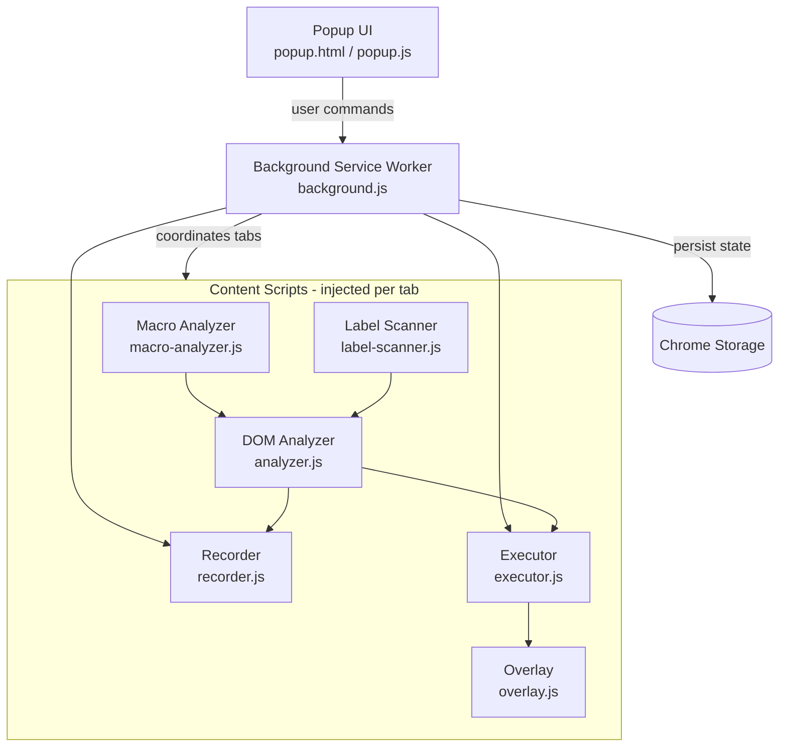

# SmartBot — Intelligent Chrome Record & Replay Automation Engine

**A DOM-aware browser automation engine that records a workflow once and intelligently replays it across multiple tabs.**


---

## Overview

SmartBot is a Chrome Extension (Manifest V3) that eliminates repetitive, multi-step browser workflows by **recording a sequence of user actions once and replaying them intelligently across one or many tabs**.

It was built to solve a real operational problem: repetitive validation workflows where the same sequence of actions — reviewing a record, selecting options, approving/updating/submitting — has to be repeated across dozens or hundreds of browser tabs, often because backend bulk-update paths aren't available due to workflow or timing constraints.

Rather than replaying clicks based on fixed screen coordinates, SmartBot analyzes the **DOM and semantic structure** of each page — labels, ARIA attributes, element fingerprints, and contextual signals — to relocate the correct element on every tab, even when layouts shift slightly between pages.

---

## Problem Statement

Many internal tools and case-management systems require a user to open a record, perform a fixed sequence of UI interactions, and submit — one tab at a time. When bulk backend updates aren't possible, this becomes pure repetitive manual labor:

- Open tab → review → click → select → submit → close → repeat
- Multiplied across dozens or hundreds of cases
- Error-prone and fatiguing when done manually at scale

A task that could take **3–4 hours** manually can often be reduced to around **1 hour** with recorded, DOM-aware automation — depending on case volume and workflow complexity.

## Solution

SmartBot lets a user **perform the workflow once, normally, on a single tab**, while the extension records the sequence of interactions. That recording can then be replayed:

- On the **current tab**, to verify correctness, or
- Across **all eligible open tabs**, to complete the full batch

Instead of coordinates, SmartBot resolves each recorded action to a live DOM element using multiple identification signals, so the same recorded workflow can adapt to minor structural differences between pages.

---

## Key Features

| Category | Capabilities |
|---|---|
| **Recording** | Start/Stop recording, duplicate-action protection, hidden-element protection |
| **Playback** | Play on current tab, play on all tabs, stop playback mid-run, adjustable playback speed |
| **Multi-tab automation** | Sequential execution across multiple browser tabs, optional auto-close of completed tabs |
| **Element detection** | DOM-based scanning, label-based identification, deep element fingerprinting, ARIA support |
| **Interaction coverage** | Text inputs, custom/native dropdowns, checkboxes, buttons, scrolling |
| **Resilience** | Mutation-aware DOM analysis, wait-for-element logic, DOM-settle detection, retry logic for tab messaging |
| **UX** | On-page progress/status overlay, persistent state via Chrome Storage |
| **Architecture** | Manifest V3 service worker, isolated content-script pipeline |

---

## Architecture

SmartBot is composed of a popup UI, a background service worker, and a pipeline of content scripts that handle recording, DOM analysis, and replay.



### 1. Popup UI
`popup/popup.html`, `popup/popup.css`, `popup/popup.js`
The control surface for the extension — start/stop recording, play on current tab or all tabs, stop playback, adjust playback speed, toggle "close tab when done," and review/edit recorded steps.

### 2. Background Service Worker
`background.js`
The coordination layer. Maintains global bot state (recording/playing flags, recorded steps, playback speed, close-tab option), communicates with tabs via `chrome.tabs` messaging with retry logic, drives multi-tab execution sequentially, and persists state through `chrome.storage.local` so the popup can be closed and reopened without losing progress.

### 3. Recorder
`content/recorder.js`
Captures user interactions as they happen — clicks, typing, dropdown selection, checkbox toggles, scrolling — while filtering out duplicate actions and skipping elements that are currently hidden or not interactable.

### 4. DOM Analyzer
`content/analyzer.js`
Scans the page for interactive elements and generates resilient selectors using a combination of labels, IDs, names, placeholders, ARIA attributes, and classes, so elements can be re-identified even if the DOM shifts.

### 5. Macro Analyzer
`content/macro-analyzer.js`
Builds deep fingerprints of page elements and their surrounding context, allowing SmartBot to recognize "the same logical field" across different pages even when the underlying selectors differ.

### 6. Label Scanner
`content/label-scanner.js`
Scans visible page fields and builds a fingerprint map that the executor consults to resolve recorded fields reliably during replay.

### 7. Executor
`content/executor.js`
Replays the recorded action sequence: waits for target elements to exist and be interactable, performs the appropriate interaction (type, select, check, click, scroll), and waits for the DOM to settle after significant actions such as submit or update operations before proceeding.

### 8. Overlay
`content/overlay.js`, `content/overlay.css`
Renders a lightweight on-page status overlay showing recording/playback state, progress, and the most recent action taken.

---

## How It Works — Intelligent Element Detection

SmartBot is **not** a simple coordinate-based macro recorder. Coordinate-based tools break the moment a page layout shifts, a banner appears, or content loads at a different pace. SmartBot instead resolves each recorded step to a live DOM element at replay time, using a layered set of signals rather than a fixed (x, y) position.

**Element-resolution signals considered, roughly in order of specificity:**

1. Associated label text
2. ARIA attributes (role, aria-label, aria-describedby, etc.)
3. Element `id`
4. Element `name`
5. Placeholder text
6. Data attributes
7. Element type / tag
8. Surrounding form / contextual structure
9. Relative page position (used as a supporting signal, not the primary one)
10. Deep element fingerprint (from the Macro Analyzer)
11. Other available DOM signals gathered during scanning

Because no single signal is treated as authoritative, SmartBot can still locate the correct field when a page re-renders, when an element's exact position shifts, or when minor DOM differences exist between otherwise-identical case pages — something purely coordinate-based automation cannot do.

---

## Example Workflow

> The following is a generic, illustrative example. No confidential company names, customer data, or internal application details are represented.

An operations user has 100 response cases open in separate browser tabs. Each case requires the same sequence of review → select → approve/update → submit actions. Instead of manually repeating that sequence 100 times, the user performs it once while SmartBot records, then replays the recorded workflow across the remaining eligible tabs.

**Manual process**
1. Open case
2. Review required information
3. Perform repetitive actions
4. Submit/update
5. Move to next tab
6. Repeat for every case

**SmartBot-assisted process**
1. Open required tabs
2. Record the workflow once
3. Execute the workflow across tabs
4. Monitor progress via the overlay
5. Automatically complete/close tabs (if enabled)

Actual time savings depend on page load speed, number of cases, workflow complexity, and target application behavior.

---

## Project Structure

```
smart-bot/
├── manifest.json
├── background.js
├── content/
│   ├── analyzer.js
│   ├── executor.js
│   ├── macro-analyzer.js
│   ├── recorder.js
│   ├── label-scanner.js
│   ├── overlay.js
│   └── overlay.css
├── popup/
│   ├── popup.html
│   ├── popup.css
│   └── popup.js
└── icons/
    ├── icon16.png
    ├── icon48.png
    └── icon128.png
```

---

## Installation

1. Download or clone this repository.
2. Open Chrome and navigate to `chrome://extensions/`.
3. Enable **Developer Mode** (top-right toggle).
4. Click **Load unpacked**.
5. Select the project folder containing `manifest.json`.
6. Pin SmartBot to the Chrome toolbar for quick access.

---

## Usage

1. Open the required response/case tabs.
2. Open the SmartBot popup.
3. Click **Start Recording**.
4. Perform the required workflow on one tab.
5. Click **Stop**.
6. Review the recorded steps in the popup (edit if needed).
7. Test with **Play on Current Tab**.
8. If the result is correct, run **Play on All Tabs**.
9. Monitor the on-page progress overlay.
10. Enable **Close tab when done** if you want completed tabs to close automatically.

> **Tip:** Always test a recorded workflow on a small number of tabs before running it against a large batch, especially for actions that submit, approve, or otherwise modify data.

---

## Technology Stack

- JavaScript (ES6+)
- HTML5 / CSS3
- Chrome Extension APIs
- Manifest V3
- DOM APIs
- `MutationObserver`
- Chrome Storage API
- Chrome Tabs API
- Chrome Scripting API
- Service Worker architecture

---

## Engineering Highlights

This project involved hands-on work across several non-trivial areas of front-end and browser-platform engineering:

- Browser automation design under Manifest V3 constraints
- Event-driven programming across popup, background, and content-script contexts
- DOM analysis and multi-signal selector engineering
- Multi-tab orchestration and sequential task coordination
- Asynchronous JavaScript (`async`/`await`, message-passing, retries)
- `MutationObserver`-based dynamic DOM handling
- Retry and error-handling logic for cross-context messaging
- Persistent state management via `chrome.storage`
- Handling of dynamic, re-rendering UI environments
- Automation reliability and resilience engineering
- End-to-end user workflow optimization

---

## Performance / Business Impact

SmartBot was built to reduce repetitive manual effort in browser-based validation workflows. By recording a workflow once and replaying it across multiple cases or tabs, it can meaningfully cut execution time on suitable repetitive tasks.

| Metric | Observed Example |
|---|---|
| Manual execution | ~3–4 hours |
| Automated execution | ~1 hour |
| Potential reduction | ~60–75% |

These figures reflect **one observed use case** and are workflow-dependent, not a universal benchmark. Actual results vary with page complexity, load times, and case volume.

---

## Limitations

- Not guaranteed to work on every possible page structure — highly dynamic or heavily obfuscated UIs may require manual review of recorded steps.
- Does not claim 100% accuracy; it is designed to be **more resilient than coordinate-based automation**, not infallible.
- Best suited to workflows with a consistent, repeatable UI pattern across tabs.
- Requires the user to validate recorded workflows before large-batch execution.

---

## Responsible Use

This project is intended for **authorized automation of repetitive workflows**. It should only be used on applications and data for which the user has appropriate permission. Users should validate automation behavior before running it on large batches — especially where actions can approve, update, submit, or otherwise change operational data.

---

## Future Improvements

- Conditional branching within recorded workflows (if/else logic per case)
- Visual step editor with drag-and-drop reordering
- Export/import of recorded workflows as shareable JSON
- Shadow-DOM and iframe traversal improvements
- Optional screenshot-based verification step before submit actions

---

## Author

Built as a personal engineering project to solve a real repetitive-workflow problem, and to demonstrate applied skills in JavaScript, Chrome Extension development, DOM analysis, browser automation, asynchronous programming, multi-tab orchestration, and workflow optimization.
